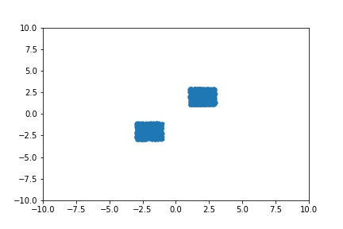
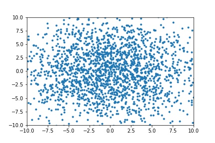
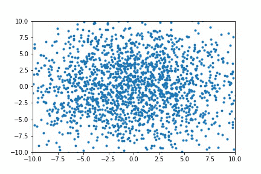
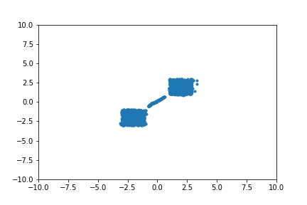
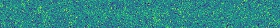
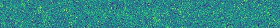

# Simple Adversarial Examples

This repo is majorly focusing on how to generating adversarial examples, including how to attack a DNN system.

## Attack a CNN visual system

As the demo shown in ```./mnist_attack_cnn```, a simple CNN classifier is first trained on the mnist dataset. Then the parameters in the well-trained CNN model is fixed. To attack the model, we assign wrong class labels to each images in the dataset. (E.g. set the label to "0", or other labels other than "1", if the image is actually a "1".) Then we use GD to train the images. By altering the images a little, following the GD and BP algorithm, the images are still recognizable for any human being, but they are confusing for the CNN model.

In addition, as stated by Ian Goodfellow, the attack can be transferred from model to model, even when the attacker has no knowledge to the model to be attacked at all. This means that one may train his own model, and perform the attack mentioned above, and use the generated data to attack another model. And he has a very high probability to perform a successful attack.

As shown below, the 9 images are all "0" to human eyes (and they are all "0" originally in the mnist dataset). We assign label "1" to "9" to them, and perform GD to adjust the input images. The result is that we get 9 images, which are "0" to human beings, but are "1"-"9" to a CNN classification model.

The original images look like...


The transformation during the GD process looks like..


The final fake images with label "1" to "9" look like...


## Generate Fake examples

The mentioned method seems viable to generate new examples, by feeding random sampled examples into the well-trained model and perform GD process to "train" the examples. However, there is a problem called "low-dimensional manifold". The real data examples do not occupy the whole data space, while they are majorly in a very compact sub-space or low-dimensional hyperplain or hyperface. If you generate samples in the way mentioned above, there is high probability that you generate something look like just noises...

Though the low-dimensional manifold problem exists, there are some ways to generate fake examples from some random samples. One simple but very effective way is the INNg. Its original motivation is to use vivid adversarial samples to help the classifier to get more accurate classification surfaces. Yet, we could see it in the other way -- this approach use a classifier to help perform a transformation upon a given distribution (e.g. uniform or gaussian) iteratively, and makes the result distribution as similar to the data distribution as possible.

In the demo in ```simple_inng_mlp```, we apply INNg-single architecture, and replace the CNN with an MLP (to make it simple). The data is random generated, and we assume only those in the two squares are real, possitive data points, while others are all fake, negative.

As shown below, we sample 2000 data points from a Gaussian distribution at first, and perform transformation upon them iteratively following INNg-single training algorithm.

The real data points are all in the two squares, which looks like...



The original samples from the Gaussian distribution look like...



The transorfation looks like...



At last, the generated fake samples looks like...



## INNg-Single of CNN on MNIST

As the demo shown in ```mnist_inng_cnn```, an INNg-single CNN-based architecture is trained on the mnist dataset. The training procedure is the same as above.

The initial fake images are basically gaussian noises, as shown...



During training, the images transforms, as the border goes darker and the center goes lighter, and some rough shapes are obtained, as shown...



The model is not finished training yet, and the latest generated images look like...


## References

```
@inproceedings{jin2017introspective,
  title={Introspective classification with convolutional nets},
  author={Jin, Long and Lazarow, Justin and Tu, Zhuowen},
  booktitle={Advances in Neural Information Processing Systems},
  pages={823--833},
  year={2017}
}
```

```
@inproceedings{lazarow2017introspective,
  title={Introspective neural networks for generative modeling},
  author={Lazarow, Justin and Jin, Long and Tu, Zhuowen},
  booktitle={Proceedings of the IEEE Conference on Computer Vision and Pattern Recognition},
  pages={2774--2783},
  year={2017}
}
```

```
@inproceedings{lee2018wasserstein,
  title={Wasserstein introspective neural networks},
  author={Lee, Kwonjoon and Xu, Weijian and Fan, Fan and Tu, Zhuowen},
  booktitle={The IEEE Conference on Computer Vision and Pattern Recognition (CVPR)},
  year={2018}
}
```

 Adversarial Examples and Adversarial Training. Lecture 16, cs231n at https://www.youtube.com/watch?v=CIfsB_EYsVI.